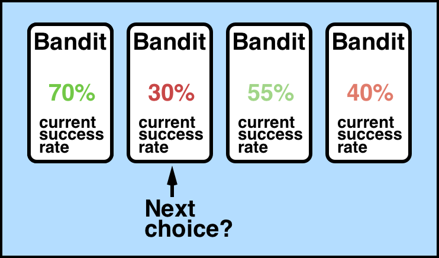

# Mult-ARM-Bandit

## Overview

The multi-armed bandit problem is a classic reinforcement learning example where we are given a slot machine with n arms (bandits) with each arm having its own rigged probability distribution of success. Pulling any one of the arms gives you a stochastic reward of either R=+1 for success, or R=0 for failure.

   

